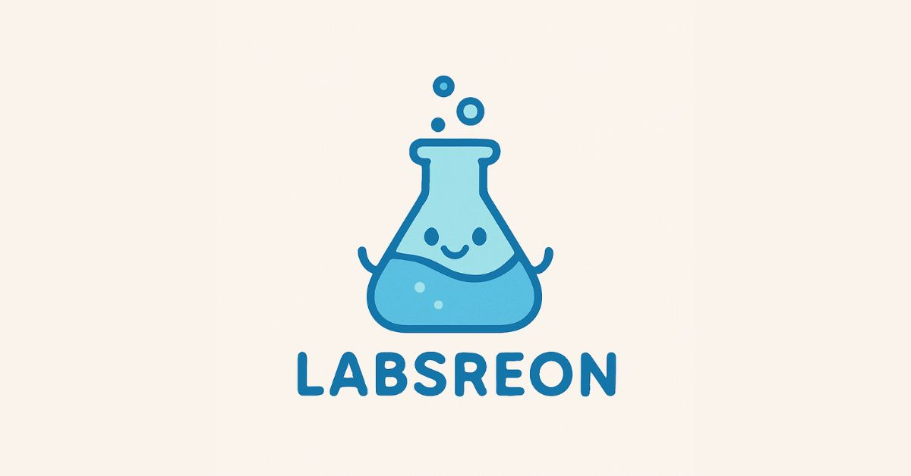

# 🌐 Asron Portfolio

Welcome to **Asron's Developer Portfolio** — a creative and modern web portfolio showcasing projects, skills, and experience in frontend development and design.



## 🚀 Tech Stack

- ⚛️ **React**
- ⚡ **Vite**
- 💅 **Styled Components**
- 🌙 **Dark/Light Theme Toggle**
- ☁️ **Supabase** (for image hosting)
- 🔠 **TypeScript**

## 🖼️ Features

- Responsive design for all devices
- Animated sections and smooth transitions
- Interactive project gallery with auto-scroll
- Theme switcher (dark/light)
- SEO optimized with Open Graph tags
- Fast performance with Vite

## 📂 Folder Structure

```
/src
  ├── components/
  ├── sections/
  ├── styles/
  ├── assets/
  └── main.tsx
```

## 🛠️ Getting Started

### 1. Clone the repo

```bash
git clone https://github.com/RonAsron/asron_portfolio.git
cd asron_portfolio
```

### 2. Install dependencies

```bash
npm install
```

### 3. Run development server

```bash
npm run dev
```

The app should now be running at [http://localhost:5173](http://localhost:5173)

## 📦 Build for Production

```bash
npm run build
```

## 🌐 Live Demo

You can view the live portfolio at:  
👉 [https://labsreon.com](https://labsreon.com) *(if deployed)*

## 📸 Screenshots


## 🙋‍♂️ About Me

Hi, I'm **Asron** — a frontend developer with a passion for clean UI and interactive experiences.  
Feel free to explore my projects and connect!

## 📬 Contact

- 📧 Email: `your.email@example.com`
- 🌐 Website: [labsreon.com](https://labsreon.com)
- 🐦 Twitter: [@yourhandle](https://twitter.com/yourhandle)
- 💼 LinkedIn: [linkedin.com/in/yourprofile](https://linkedin.com/in/yourprofile)

## 📄 License

This project is licensed under the [MIT License](./LICENSE)